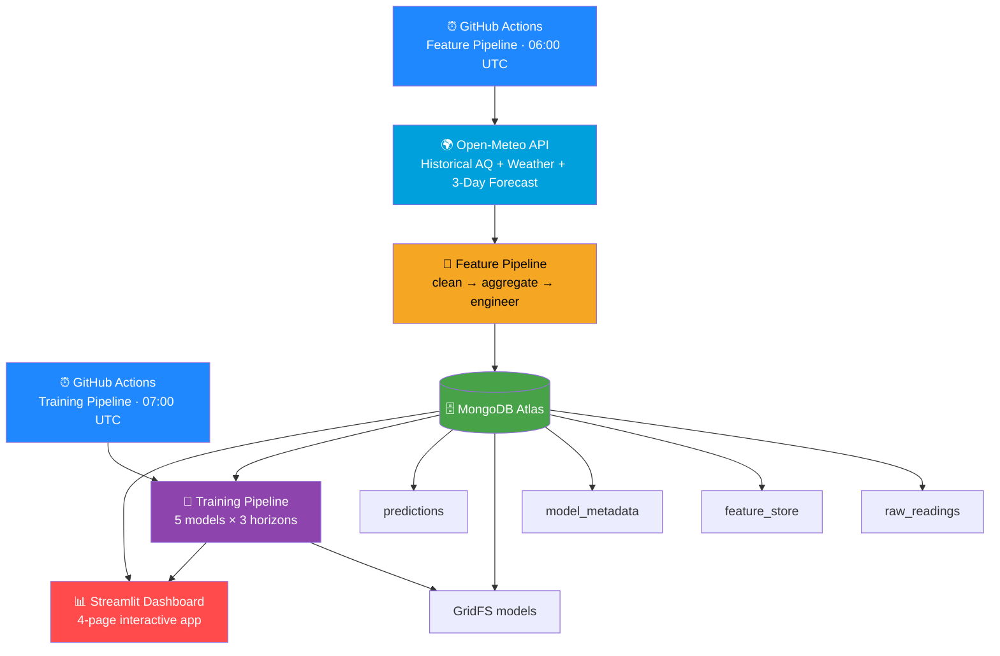

<div align="center">

# 🌫️ Pearl AQI Predictor

### *Production-Grade, Serverless 3-Day Air Quality Forecasting System*


<br>

[](https://www.python.org/)
[](https://streamlit.io/)
[](https://www.mongodb.com/)
[](https://github.com/features/actions)
[](LICENSE)

<br>

[](https://github.com/abrarghoury/Pearl_Aqi)
[](https://github.com/abrarghoury/Pearl_Aqi)
[](https://github.com/abrarghoury/Pearl_Aqi/stargazers)


<br>

### 🔗 [**Launch Live Dashboard →**](https://airlens-istanbul.streamlit.app)

📍 **City:** Istanbul, Turkey &nbsp;·&nbsp; 🗄️ **Store:** MongoDB Atlas &nbsp;·&nbsp; ⚙️ **Pipelines:** GitHub Actions &nbsp;·&nbsp; 🧠 **Models:** 5 Competing Algorithms

</div>

<br>

---

## 📖 Table of Contents

<table>
<tr>
<td width="50%" valign="top">

- [📌 Overview](#-overview)
- [✨ Key Features](#-key-features)
- [🏗️ System Architecture](#️-system-architecture)
- [📊 Model Performance](#-model-performance)
- [⚙️ Feature Engineering](#️-feature-engineering)

</td>
<td width="50%" valign="top">

- [📱 Dashboard Pages](#-dashboard-pages)
- [🗂️ Project Structure](#️-project-structure)
- [🚀 Quick Start](#-how-to-run-locally)
- [🌐 Deployment](#-deployment)
- [🧠 ML Design Decisions](#-ml-design-decisions)

</td>
</tr>
</table>

---

<br>

## 📌 Overview

> **Pearl AQI Predictor** is a fully automated, end-to-end machine learning system that forecasts the Air Quality Index (AQI) for **Istanbul up to 3 days in advance**. It fuses historical pollution data, real-time weather, and forward-looking weather forecasts into a single prediction engine — running on a **100% serverless, zero-infrastructure stack**.

<div align="center">

### 🌤️ *No servers. No manual runs. Just clean air quality intelligence, delivered daily.* 🌤️

</div>

<br>

## ✨ Key Features

<table>
<tr>
<td align="center" width="25%">🔮<br><b>3-Day Forecast</b><br><sub>Day 1 / 2 / 3 AQI with confidence levels</sub></td>
<td align="center" width="25%">🤖<br><b>5-Model AutoSelect</b><br><sub>XGBoost · LightGBM · RF · GBM · Ridge</sub></td>
<td align="center" width="25%">🔍<br><b>SHAP Explainability</b><br><sub>Waterfall & feature-shift charts</sub></td>
<td align="center" width="25%">📈<br><b>Trend Analysis</b><br><sub>30-day history + forecast overlay</sub></td>
</tr>
<tr>
<td align="center" width="25%">⚡<br><b>Fully Automated</b><br><sub>Daily GitHub Actions pipelines</sub></td>
<td align="center" width="25%">☁️<br><b>Serverless Stack</b><br><sub>$0/month — Atlas + Streamlit + Actions</sub></td>
<td align="center" width="25%">🏥<br><b>Health Advisories</b><br><sub>Worst-case 3-day health guidance</sub></td>
<td align="center" width="25%">🌦️<br><b>Forecast-Aware</b><br><sub>Open-Meteo 3-day input features</sub></td>
</tr>
</table>

<br>

## 🏗️ System Architecture



<br>

## 📊 Model Performance

<div align="center">

| Horizon | Winning Model | CV RMSE | Test R² | Confidence |
|:---:|:---:|:---:|:---:|:---:|
| 🟢 **Day 1** | Ridge | 12.39 | **0.874** | 🟢 High |
| 🟡 **Day 2** | GradientBoosting | 20.11 | **0.633** | 🟡 Moderate |
| 🟠 **Day 3** | GradientBoosting | 17.92 | **0.518** | 🟠 Low |

</div>

```
R² Score by Horizon
Day 1  ████████████████████████████████████░░░░  0.874
Day 2  ██████████████████████████░░░░░░░░░░░░░░  0.633
Day 3  ████████████████████░░░░░░░░░░░░░░░░░░░░  0.518
```

> 💡 **Insight:** Day 2/3 models use the Open-Meteo 3-day weather forecast as input features (`fc_temp_d1/d2/d3`, `fc_pressure_d1/d2/d3`). Without forecast weather signal, Day 3 R² was **0.05**. Adding forecast features pushed it to **0.52** — a **10× improvement**.

<br>

## ⚙️ Feature Engineering

<div align="center">

**31 engineered features**, built from raw hourly readings aggregated to daily granularity.

</div>

<details open>
<summary><b>📦 Click to expand full feature catalogue</b></summary>

<br>

| Category | Features |
|---|---|
| 🌫️ **AQI Aggregations** | `aqi_mean`, `aqi_max`, `aqi_min`, `aqi_std`, `aqi_last6h` |
| 🧪 **Pollutants** | `pm2_5_mean`, `pm10_mean` |
| ☁️ **Weather** | `temp_mean/max/min`, `humidity_mean`, `wind_mean/max`, `pressure_mean` |
| ⏮️ **Lag Features** | `aqi_lag1d/2d/3d/7d`, `pm2_5_lag1d/2d` |
| 🔄 **Rolling Features** | `aqi_roll_mean_3`, `aqi_roll_mean_7` |
| 📉 **Trend + Delta** | `aqi_trend_1d/3d`, `aqi_diff`, `aqi_pct_change`, pollutant/weather diffs |
| 📊 **Volatility** | `aqi_std_7d` |
| 🗓️ **Time** | `month_sin`, `month_cos`, `dow` |
| 🔮 **Forecast Weather** | `fc_temp/humidity/wind/pressure/precip_d1/d2/d3`, `fc_pressure_drop_d1` |

</details>

<br>

## 📱 Dashboard Pages

<table>
<tr>
<td width="50%">

### 🏠 Predictive AQI Forecast
Colour-coded Day 1/2/3 cards showing AQI values, categories, confidence, and a live health advisory.

### 📈 Historical Trends
30-day actual AQI overlaid with predictions, plus a full pollutant breakdown.

</td>
<td width="50%">

### 🔍 Explainable AI (SHAP)
Feature-impact bar charts, waterfall breakdowns, and how importance shifts from Day 1 → Day 2 → Day 3.

### 📉 Model Performance
Live training metrics — R², RMSE, scatter plots, and residual diagnostics.

</td>
</tr>
</table>

<br>

## 🗂️ Project Structure

```
Pearl_Aqi/
│
├── 🔧 .github/workflows/
│   ├── feature_pipeline.yml       # Daily — fetch + engineer features
│   └── training_pipeline.yml      # Daily — train 5 models per target
│
├── ⚙️ config/
│   └── settings.py                # MongoDB URI, city coords, feature cols
│
├── 📥 ingestion/
│   └── fetch_openmeteo.py         # Historical AQ + weather + 3-day forecast
│
├── 🧹 features/
│   ├── clean.py                   # Outlier capping, null filling, dedup
│   ├── compute_features.py        # Lag, rolling, delta, forecast features
│   └── feature_store.py           # MongoDB upsert / read
│
├── 🔁 pipelines/
│   ├── backfill_pipeline.py       # Run once — 2 years of history
│   ├── feature_pipeline.py        # Daily automated run
│   └── training_pipeline.py       # Daily automated run
│
├── 🧠 models/
│   ├── train.py                   # 5-model competition + TimeSeriesSplit CV
│   ├── evaluate.py                # RMSE, MAE, R² scoring
│   └── registry.py                # GridFS model versioning
│
├── 🖥️ app/
│   ├── app.py                     # Streamlit entry point + sidebar
│   ├── predict.py                 # Model inference + SHAP computation
│   └── components/
│       ├── page_prediction.py     # Page 1 — 3-day forecast cards
│       ├── page_trend.py          # Page 2 — AQI trend + pollutant charts
│       ├── page_shap.py           # Page 3 — SHAP explainability
│       └── page_model_metrics.py  # Page 4 — R², RMSE, scatter plots
│
├── 📓 notebooks/
│   ├── 01_EDA.ipynb
│   ├── 02_feature_engineering.ipynb
│   └── 03_model_experiments.ipynb
│
├── requirements.txt
├── .python-version
└── README.md
```

<br>

## 🚀 How to Run Locally

<details open>
<summary><b>📋 Prerequisites</b></summary>
<br>

- Python 3.11
- MongoDB Atlas account (free tier works)
- Open-Meteo API — free, **no key required**

</details>

<br>

**1️⃣ Clone the repo**

```bash
git clone https://github.com/abrarghoury/Pearl_Aqi.git
cd Pearl_Aqi
```

**2️⃣ Create a virtual environment**

```bash
python -m venv venv
venv\Scripts\activate        # Windows
source venv/bin/activate     # Mac/Linux
```

**3️⃣ Install dependencies**

```bash
pip install -r requirements.txt
```

**4️⃣ Configure environment variables** — create a `.env` file in the project root:

```env
MONGODB_URI=mongodb+srv://...
MONGODB_DB_NAME=aqi_db
CITY_NAME=Istanbul
CITY_LAT=41.0082
CITY_LON=28.9784
TIMEZONE=Europe/Istanbul
PIPELINE_MODE=daily
```

**5️⃣ Backfill historical data** *(one-time, set `PIPELINE_MODE=backfill`)*

```bash
python -m pipelines.backfill_pipeline
```

**6️⃣ Train the models** *(set `PIPELINE_MODE=daily`)*

```bash
python -m pipelines.training_pipeline
```

**7️⃣ Launch the dashboard**

```bash
streamlit run app/app.py
```

<br>

## 🌐 Deployment

<div align="center">

| Component | Service | Cost |
|:---|:---:|:---:|
| 🗄️ Data + Model Storage | MongoDB Atlas M0 | 🆓 Free |
| 🖥️ Dashboard Hosting | Streamlit Cloud | 🆓 Free |
| ⚙️ Pipeline Automation | GitHub Actions | 🆓 Free |
| 🌍 Weather + AQ Data | Open-Meteo API | 🆓 Free |

### 💰 Total infrastructure cost: **$0/month**

</div>

<br>

## 🧠 ML Design Decisions

<details>
<summary><b>🤔 Why 5 competing models?</b></summary>
<br>
Each of the 3 targets (Day 1/2/3) trains XGBoost, LightGBM, RandomForest, GradientBoosting, and Ridge. The winner is selected by <b>TimeSeriesSplit CV RMSE</b> — never the test set — to prevent leakage.
</details>

<details>
<summary><b>🌦️ Why forecast weather features?</b></summary>
<br>
Without forward-looking weather signal, Day 3 R² was <b>0.05</b> (essentially random). Adding <code>fc_pressure_d3</code>, <code>fc_wind_d3</code>, etc. pushed it to <b>0.52</b> — wind and pressure dispersion patterns are the primary drivers of 3-day AQI variance.
</details>

<details>
<summary><b>🗄️ Why MongoDB GridFS for models?</b></summary>
<br>
Serverless environments have no persistent file system. GridFS stores serialized model bytes directly inside MongoDB — the same database used for features — keeping the stack minimal and dependency-free.
</details>

<details>
<summary><b>🔒 How is data leakage prevented?</b></summary>
<br>
All lag/rolling features use a minimum <code>shift(1)</code>. Target columns are excluded from feature lists with hard-stop checks enforced at both the feature-engineering and training stages.
</details>

<br>

## 🗺️ Roadmap

- [x] 3-day AQI forecasting with 5-model competition
- [x] SHAP explainability dashboard
- [x] Fully automated daily pipelines
- [ ] Multi-city support
- [ ] Push notifications for hazardous AQI alerts
- [ ] Mobile-friendly PWA dashboard

<br>

## 🤝 Contributing

Contributions, issues, and feature requests are welcome!
Feel free to check the [issues page](https://github.com/abrarghoury/Pearl_Aqi/issues) or open a pull request.

<br>

---

## 📬 Contact

<div align="center">

**Abrar Ghoury**

[](mailto:abrarshakeel21@gmail.com)
[](https://www.linkedin.com/in/abrar-ghoury/)
[](https://github.com/abrarghoury)

<br>

*Built with ❤️ using Python, MongoDB Atlas, Streamlit, and Open-Meteo*

**⭐ If you found this useful, please star the repo! ⭐**

</div>